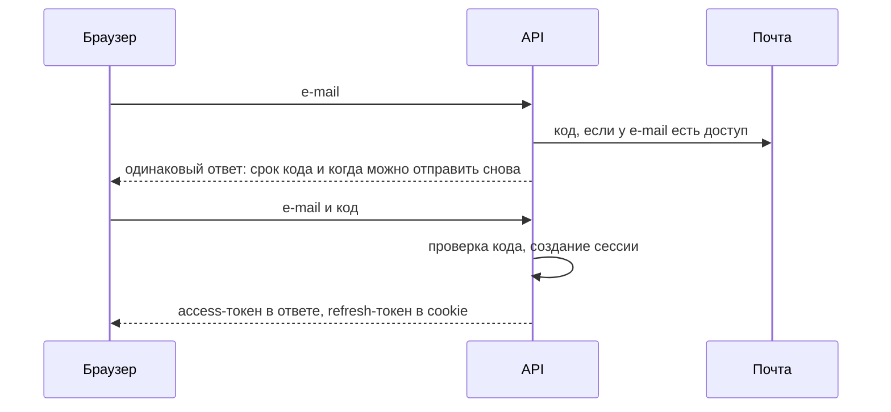
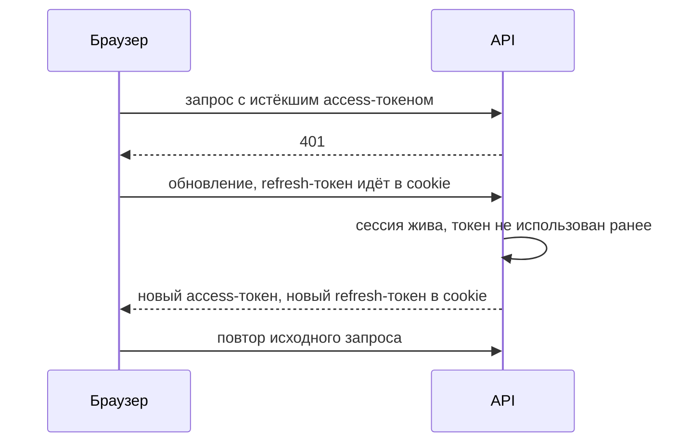
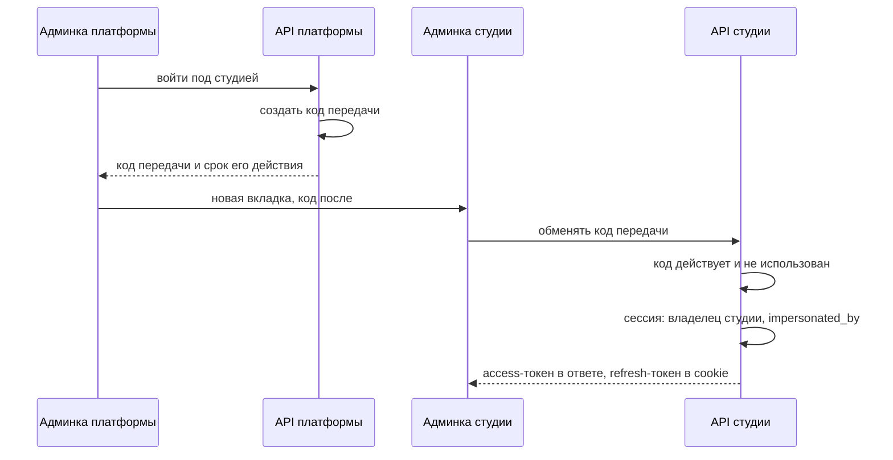

# Вход и сессии

**Scope:** как в StudioDesk устроены вход, токены и сессии для API платформы и API студии: вход по коду, обновление токенов, защита cookie, выход, немедленный отзыв доступа, вход под студией.

## Эссе — что это

Вход одинаков для администратора платформы и для владельцев студий: e-mail, код на почту, ввод кода. Паролей нет. После ввода кода бэкенд открывает сессию и выдаёт два токена: короткий access-токен для запросов и долгий refresh-токен, чтобы получать новые access-токены без повторного входа.

Схема общая для API платформы и API студии. Продуктовые правила входа (тексты, состояния экрана, запрет перечисления e-mail) описаны в каноне темы: `../01-product/platform-admin/overview.md`. Адреса и данные конкретного API — в его контракте, например `../01-product/platform-admin/api-contract.md`.

## Эссе — токены и сессии

- **Сессия** — запись в базе об одном входе. Она знает: чей это вход, к какому API он относится (`platform` или `studio`), для студии — `studio_id`, когда создана, когда истекает, отозвана ли, и для входа под студией — кто из администраторов платформы её открыл (`impersonated_by`).
- **Срок сессии** скользящий: каждое обновление токенов продлевает сессию на 30 дней. Кто не заходил 30 дней, входит заново. Независимо от активности сессия живёт не дольше 90 дней от входа.
- **Access-токен** — подписанный JWT на 15 минут. Внутри: пользователь, id сессии, API, для студии — `studio_id`. Фронтенд держит его только в памяти страницы (переменная JavaScript) и передаёт в заголовке `Authorization: Bearer`. После перезагрузки страницы или в новой вкладке памяти нет: фронтенд сначала вызывает обновление токенов и получает новый access-токен.
- **Refresh-токен** — случайная строка. В базе хранится только её хеш. Браузер хранит её в cookie, скрипт страницы её не видит, поэтому её нельзя украсть через XSS. Браузер сам прикладывает cookie к запросу обновления.

**Почему нужна таблица сессий.** Короткий access-токен сам по себе не отзывается: он работает до конца своих 15 минут. А продукт требует отзывать доступ сразу: после смены владельца токены прежнего владельца не работают со следующего запроса. Поэтому guard на каждом запросе проверяет не только подпись токена, но и то, что его сессия не отозвана и не истекла. Это один запрос к своей базе.

**Ротация.** При каждом обновлении выдаётся новый refresh-токен, старый перестаёт действовать. Если кто-то предъявит уже использованный refresh-токен, значит, его скопировали: сессия отзывается целиком, и войти придётся заново.

**Окно для соседних вкладок.** Две вкладки могут обновить токены одновременно одним и тем же refresh-токеном, и вторая выглядела бы как повторное использование. Поэтому сессия помнит хеш текущего и предыдущего refresh-токена и время последней ротации. Предыдущий токен принимается не дольше 10 секунд после ротации: выдаётся новая пара для той же сессии. Позже — это повторное использование, сессия отзывается. Cookie одна на весь браузер, поэтому после обновления все вкладки пользуются одним, последним refresh-токеном.

## Эссе — защита cookie

Браузер прикладывает cookie к каждому запросу на её адрес сам, не разбираясь, какая страница начала запрос. Поэтому чужой сайт, открытый в соседней вкладке, мог бы отправить запрос на наш API, и браузер приложил бы к нему нашу cookie. Это подделка межсайтового запроса (CSRF). Защита из четырёх слоёв, каждый закрывает то, что пропускает другой:

1. **`SameSite=Strict`** — браузер не прикладывает cookie, если запрос начат с чужого сайта.
2. **Обязательный заголовок `X-Requested-With`** на адресах обновления токенов и выхода. Для браузера «свой сайт» — весь `axondigital.xyz`, где работают и другие проекты, и от них `SameSite` не защищает. Добавить свой заголовок в запрос на чужой адрес страница может только с разрешения CORS.
3. **CORS** — API принимает запросы из браузера только с `admin.studio-desk.axondigital.xyz` и `app.studio-desk.axondigital.xyz`.
4. **`Path`** — cookie уходит только на адреса входа своего API: `/api/platform/auth` или `/api/studio/auth`. Сессии платформы и студии в одном браузере не мешают друг другу.

Атрибуты cookie целиком: `HttpOnly; Secure; SameSite=Strict; Path=/api/<platform|studio>/auth`.

## Эссе — потоки по шагам

### Вход по коду

Ответ на запрос кода одинаков, есть у e-mail доступ или нет. Срок жизни кода, лимиты попыток и повторных отправок решает бэкенд.

### Обновление токенов

Если одновременно ждут несколько запросов, фронтенд делает одно обновление на всех и повторяет их после него. Так же, одним обновлением, начинается каждая загрузка страницы.

Если refresh-токен уже был использован, сессия отзывается, ответ 401, фронтенд показывает экран входа.

Ответ на неудачное обновление различает два случая, чтобы человек, который ещё не входил, не увидел сообщения об истёкшей сессии:
- cookie нет — `401 UNAUTHORIZED`, обычный экран входа;
- сессия истекла, отозвана или refresh-токен использован повторно — `401 SESSION_EXPIRED`, экран входа с сообщением об истёкшей сессии.

### Выход (Sign out)

Фронтенд вызывает адрес выхода. Бэкенд отзывает сессию и очищает cookie. Access-токен этой сессии отклоняется со следующего запроса.

### Немедленный отзыв

- **Смена владельца студии.** Отзываются все сессии прежнего владельца в этой студии, включая сессии входа под студией.
- **Деактивация студии.** Отзываются все сессии этой студии, кроме сессий входа под студией. Новый вход владельца и сотрудников в деактивированную студию отклоняется.

### Вход под студией

Администратор платформы открывает админку студии (`app.studio-desk.axondigital.xyz`) от имени её владельца, в новой вкладке. Админка платформы остаётся открытой. Токен в адресе страницы не передаётся: адрес остаётся в истории браузера и логах серверов. Вместо него передаётся **код передачи** (handoff code) — как номерок в гардеробе: сам по себе не доступ, а право один раз получить доступ. Это не код из письма: код из письма нужен для входа человека, код передачи — только для перехода из админки платформы в админку студии.

- Код передачи живёт 60 секунд и срабатывает один раз. В базе хранится его хеш.
- Код передачи выдаётся только администратору платформы, для студии в любом состоянии, включая Deactivated.
- Новую вкладку фронтенд платформы открывает сразу по клику, пустой, и переводит её на адрес с кодом после ответа API. Вкладку, открытую после ответа сервера, браузер блокирует как всплывающее окно.
- Фронтенд платформы открывает адрес админки студии с кодом после `#`, например `https://app.studio-desk.axondigital.xyz/…#code=…`. Часть адреса после `#` не отправляется на серверы и не попадает в их логи. Имя страницы выбирает фронтенд.
- Админка студии обменивает код передачи вызовом `POST /api/studio/auth/impersonation/exchange` с `{ code }`. Адрес описан в `../01-product/platform-admin/api-contract.md` и делается вместе с админкой платформы.
- Сессия входа под студией — обычная сессия API студии со сроками как у любой сессии, с отметкой `impersonated_by`. Отметка отличает действия администратора от действий владельца.

## Эссе — как связано

- Устройство трёх API и guards: `backend-structure.md`.
- Формат ошибок и ответов: `api-conventions.md`.
- Продуктовые правила входа: `../01-product/platform-admin/overview.md`.
- Адреса и данные API платформы: `../01-product/platform-admin/api-contract.md`.

## Агент — правила

- Каждый запрос с access-токеном проверяет подпись, срок и состояние сессии.
- Refresh-токены и коды передачи хранятся в базе только в виде хеша.
- Cookie refresh-токена: `HttpOnly; Secure; SameSite=Strict; Path=/api/<platform|studio>/auth`.
- Адреса обновления токенов и выхода требуют заголовок `X-Requested-With`.
- CORS разрешает только `admin.studio-desk.axondigital.xyz` и `app.studio-desk.axondigital.xyz`.
- Использованный повторно refresh-токен отзывает сессию.
- Предыдущий refresh-токен принимается в течение 10 секунд после ротации.
- Сессия одного API не принимается другим API.
- Сессия API студии принимается только для своего `studio_id`.

## Агент — запреты

- Токен или refresh-токен в адресе страницы.
- Refresh-токен в `localStorage` или в теле ответа.
- Access-токен в `localStorage`, `sessionStorage` или cookie.
- Код передачи в адресе страницы до `#`.
- Пароли.
- Повторное использование кода передачи.
- Служебные пользователи студий для входа под студией.

## Открытые вопросы

- Несколько студий одного владельца в разных вкладках одного браузера: тема админки студии.
